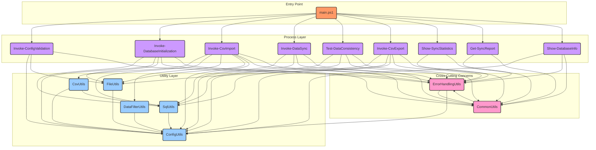

```mermaid
graph TD
    subgraph "Entry Point"
        main("main.ps1")
    end

    subgraph "Process Layer"
        config_validation("Invoke-ConfigValidation")
        db_init("Invoke-DatabaseInitialization")
        csv_import("Invoke-CsvImport")
        data_sync("Invoke-DataSync")
        consistency_test("Test-DataConsistency")
        csv_export("Invoke-CsvExport")
        stats("Show-SyncStatistics")
        report("Get-SyncReport")
        db_info("Show-DatabaseInfo")
    end

    subgraph "Utility Layer"
        config_utils("ConfigUtils")
        sql_utils("SqlUtils")
        csv_utils("CsvUtils")
        file_utils("FileUtils")
        filter_utils("DataFilterUtils")
    end
    
    subgraph "Cross-Cutting Concerns"
        error_utils("ErrorHandlingUtils")
        common_utils("CommonUtils")
    end

    main --> config_validation
    main --> db_init
    main --> csv_import
    main --> data_sync
    main --> consistency_test
    main --> csv_export
    main --> stats
    main --> report
    main --> db_info

    config_validation --> config_utils
    config_validation --> file_utils
    config_validation --> error_utils
    
    db_init --> sql_utils
    db_init --> config_utils
    db_init --> file_utils
    db_init --> error_utils
    db_init --> common_utils

    csv_import --> csv_utils
    csv_import --> sql_utils
    csv_import --> filter_utils
    csv_import --> file_utils
    csv_import --> config_utils
    csv_import --> error_utils
    csv_import --> common_utils

    data_sync --> sql_utils
    data_sync --> config_utils
    data_sync --> error_utils
    data_sync --> common_utils

    consistency_test --> sql_utils
    consistency_test --> config_utils
    consistency_test --> error_utils
    consistency_test --> common_utils

    csv_export --> sql_utils
    csv_export --> file_utils
    csv_export --> config_utils
    csv_export --> error_utils
    csv_export --> common_utils

    stats --> error_utils
    stats --> common_utils

    report --> error_utils
    report --> common_utils

    db_info --> config_utils
    db_info --> error_utils
    db_info --> common_utils

    sql_utils --> config_utils
    csv_utils --> config_utils
    csv_utils --> sql_utils
    file_utils --> config_utils
    filter_utils --> config_utils
    
    error_utils --> common_utils
    error_utils --> config_utils
    common_utils --> error_utils
    
    classDef process fill:#c9f,stroke:#333,stroke-width:2px;
    classDef utils fill:#9cf,stroke:#333,stroke-width:2px;
    classDef cross fill:#f9c,stroke:#333,stroke-width:2px;
    classDef entry fill:#f96,stroke:#333,stroke-width:2px;

    class main entry;
    class config_validation,db_init,csv_import,data_sync,consistency_test,csv_export,stats,report,db_info process;
    class config_utils,sql_utils,csv_utils,file_utils,filter_utils utils;
    class error_utils,common_utils cross;
```
